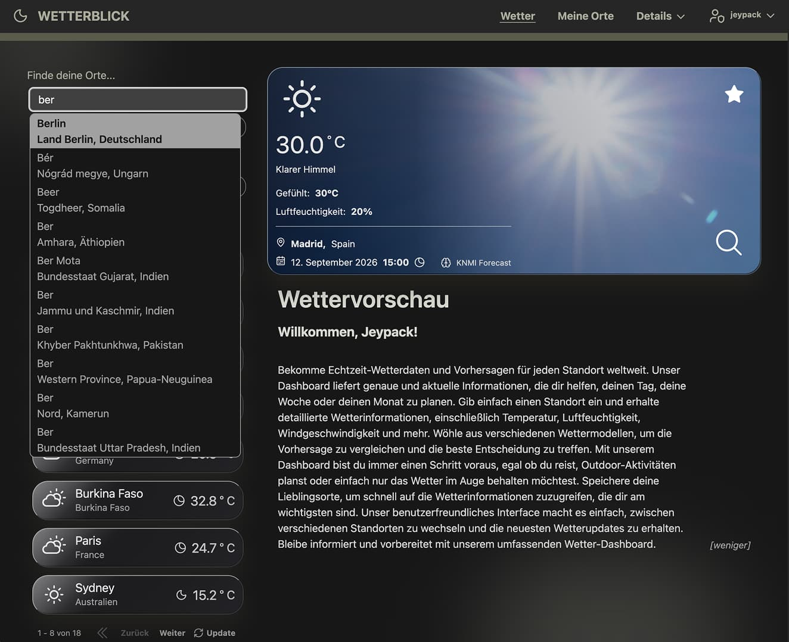
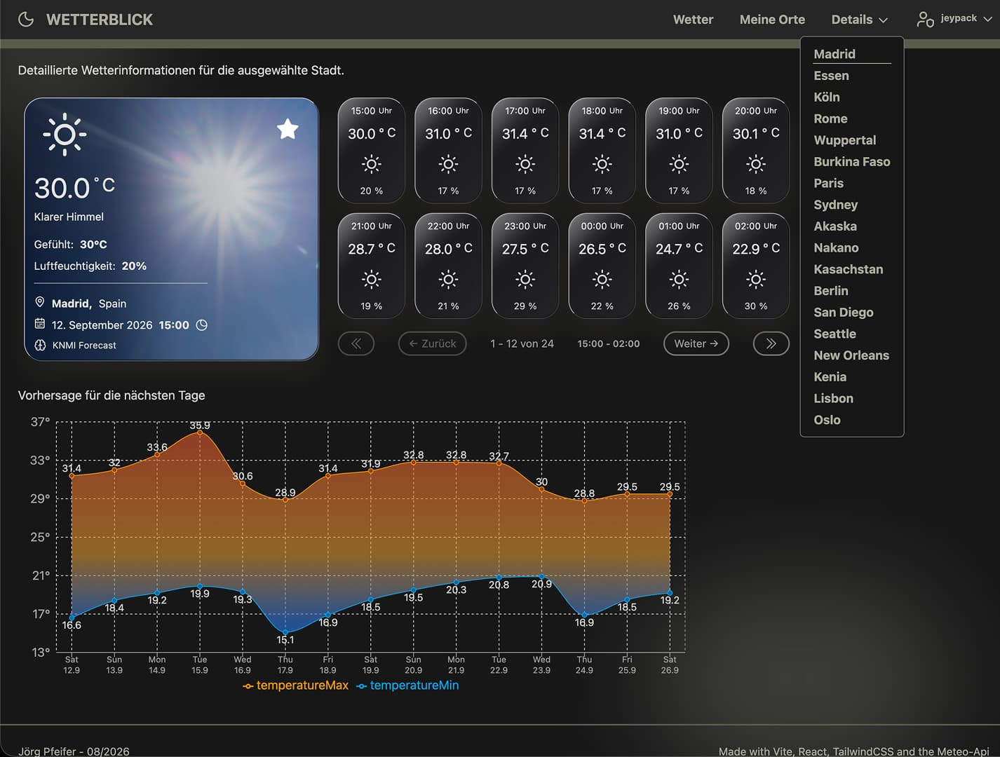
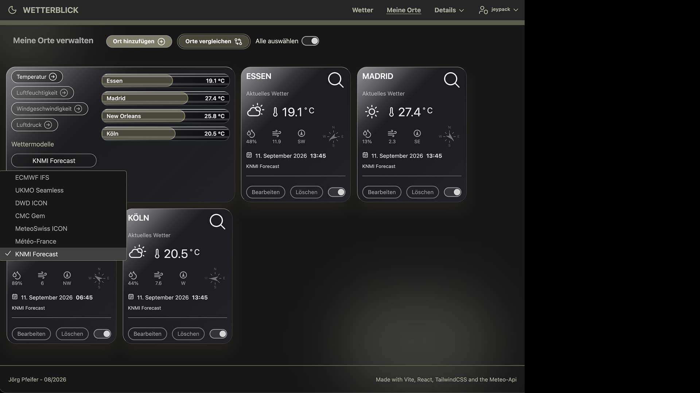

# Wetterblick

Wetterblick ist eine responsive Wetteranwendung auf Basis von React. Die Anwendung ermöglicht es, Wetterdaten für verschiedene Orte zu suchen, detailliert anzuzeigen und häufig verwendete Orte als Favoriten zu speichern und miteinander zu vergleichen.

Die Anwendung wurde als Abschlussprojekt im **Modul 3** entwickelt und verbindet eine externe Wetter-API mit Firebase Authentication und Firestore. Die Benutzeroberfläche wurde mit Tailwind CSS umgesetzt.

## Screenshots

### Dashboard



Das Dashboard bietet eine Orts-Suche mit Autovervollständigung und Suchergebnissen. Zuletzt aufgerufene Orte werden in der Seitenleiste angezeigt und können direkt erneut ausgewählt werden.

### Wetterdetails



Die Detailseite zeigt die Wetterentwicklung für einen ausgewählten Ort. Neben einer stündlichen Übersicht werden die Vorhersagen für die kommenden Tage dargestellt. Über das geöffnete Menü im Header können weitere Orte direkt ausgewählt werden.

### Favoriten



Auf der Favoritenseite können gespeicherte Orte miteinander verglichen werden.

---

## Features

* Suche nach Orten mit Autovervollständigung
* Anzeige aktueller Wetterdaten
* Stündliche Wettervorhersage
* Vorhersage für die kommenden Tage
* Anzeige von Wetterdetails und Messwerten
* Verwaltung zuletzt aufgerufener Orte
* Favoritenverwaltung
* Vergleich gespeicherter Orte
* Gastmodus ohne Benutzerkonto
* Registrierung und Login mit Firebase Authentication
* Speicherung persönlicher Daten und Favoriten über Firestore
* Responsive Benutzeroberfläche
* Clientseitiges Routing
* Formularvalidierung
* Datenvisualisierung mit Recharts

---

## Tech Stack

### Frontend

* **React 19**
* **React Router**
* **Vite**
* **Tailwind CSS**
* **Headless UI**
* **Heroicons / Lucide React**

### Daten und APIs

* **Open-Meteo** für Wetter- und Geodaten
* **Firebase Authentication** für Benutzerkonten
* **Cloud Firestore** zur Speicherung von Benutzerdaten, Favoriten und zuletzt aufgerufenen Orten

### Formulare und Validierung

* **React Hook Form**
* **Yup**

### Visualisierung

* **Recharts**

### Entwicklung und Qualitätssicherung

* **ESLint**
* **Prettier**
* **Vitest**
* **Testing Library**
* **JSDoc**

---

## Architektur

Die Anwendung ist in mehrere Bereiche gegliedert. Die globale Zustands- und Datenverwaltung erfolgt über React Contexts.

Vereinfacht ergibt sich folgender Datenfluss:

```text
                         Wetterblick
                              │
             ┌────────────────┼────────────────┐
             │                │                │
             ▼                ▼                ▼
        AuthProvider    UserDataProvider   WeatherDataProvider
             │                │                │
             ▼                ▼                ▼
          Firebase         Firestore       Open-Meteo
       Authentication
```

### AuthProvider

Der `AuthProvider` verwaltet den Authentifizierungsstatus der Anwendung.

Er stellt unter anderem Informationen darüber bereit, ob ein Benutzer angemeldet ist und welcher Benutzer aktuell aktiv ist.

Die Authentifizierung erfolgt über **Firebase Authentication**.

### UserDataProvider

Der `UserDataProvider` verwaltet benutzerbezogene Daten.

Dazu gehören insbesondere:

* Benutzername
* Favoriten
* zuletzt aufgerufene Orte

Die Daten werden für angemeldete Benutzer in **Cloud Firestore** gespeichert.

### WeatherDataProvider

Der `WeatherDataProvider` übernimmt die Kommunikation mit den Wetterdiensten und stellt die Wetterdaten für die verschiedenen Komponenten bereit.

Für die Wettervorhersage werden Daten von **Open-Meteo** verwendet.

---

## Wetterdaten

Wetterblick verwendet Open-Meteo als externe Datenquelle.

Für die Wettervorhersage können unterschiedliche Wettermodelle verwendet werden. Unter anderem werden folgende Modelle unterstützt:

* KNMI Seamless
* ECMWF IFS
* MeteoSwiss ICON Seamless
* GFS

Die Anwendung verarbeitet die von der API gelieferten Daten und stellt sie in einer für die Benutzeroberfläche geeigneten Form bereit.

---

## Benutzer und Daten

Die Anwendung kann grundsätzlich auch ohne Benutzerkonto verwendet werden.

### Gastmodus

Ein Gast kann:

* Orte suchen
* Wetterdaten anzeigen
* Orte erneut aufrufen
* Favoriten verwenden

Beim späteren Login werden die im Gastmodus vorhandenen relevanten Daten mit den Benutzerdaten zusammengeführt.

### Angemeldete Benutzer

Nach der Anmeldung werden persönliche Daten über Firebase und Firestore gespeichert.

Gespeichert werden unter anderem:

```text
User
├── username
├── favorites
└── recentLocations
```

Die Liste der zuletzt aufgerufenen Orte ist auf **acht Einträge** begrenzt.

Beim Logout werden die benutzerspezifischen Daten aus dem aktiven Anwendungszustand entfernt.

---

## Routing

Die Anwendung verwendet `react-router-dom` für die clientseitige Navigation.

Die Anwendung enthält unter anderem Bereiche für:

* Dashboard
* Wetterdetails
* Favoriten
* Benutzerbezogene Funktionen

Für die Verwendung innerhalb des Portfolios wird die Anwendung unter einem eigenen Base-Pfad betrieben:

```text
/demos/weather/
```

Dafür wird der `BrowserRouter` mit einem entsprechenden `basename` verwendet.

---

## Formulare und Validierung

Formulare werden mit **React Hook Form** umgesetzt.

Die Validierung erfolgt mit **Yup**.

Dadurch werden Eingaben bereits vor der Verarbeitung validiert und die Validierungsregeln von der Darstellung des Formulars getrennt.

---

## Datenvisualisierung

Für die Darstellung der Wetterentwicklung wird **Recharts** verwendet.

Die Wetterdaten werden dadurch unter anderem als zeitliche Verläufe dargestellt und ermöglichen eine schnelle visuelle Einschätzung der Wetterentwicklung.

---

## Projektstruktur

Eine vereinfachte Darstellung der Anwendung:

```text
.
├── docs/
│   └── images/
│       ├── screenshot-weather.jpg
│       ├── screenshot-weather-2.jpg
│       └── screenshot-weather-3.jpg
│
├── public/
│
├── src/
│   ├── components/
│   ├── contexts/
│   ├── hooks/
│   ├── pages/
│   ├── services/
│   ├── data/
│   ├── utils/
│   ├── App.jsx
│   └── main.jsx
│
├── jsdoc.json
├── package.json
├── vite.config.js
└── README.md
```

Die genaue Struktur kann je nach aktuellem Entwicklungsstand weitere Unterordner und Komponenten enthalten.

---

## Installation

Voraussetzung ist eine aktuelle Node.js-Installation.

Repository klonen und Abhängigkeiten installieren:

```bash
git clone <repository-url>
cd wetterblick
npm install
```

Für die Firebase-Anbindung müssen die entsprechenden Konfigurationswerte eingerichtet werden.

---

## Entwicklung

Die Entwicklungsumgebung wird mit Vite gestartet:

```bash
npm run dev
```

Anschließend ist die Anwendung standardmäßig unter der von Vite ausgegebenen lokalen URL erreichbar.

---

## Build

Für einen Produktions-Build:

```bash
npm run build
```

Eine lokale Vorschau des erzeugten Builds kann mit folgendem Befehl gestartet werden:

```bash
npm run preview
```

---

## Tests

Die Tests werden mit **Vitest** ausgeführt:

```bash
npm test
```

Für die Entwicklung mit automatischem erneuten Ausführen:

```bash
npm run test:watch
```

---

## Linting

Zur Überprüfung des Codes wird ESLint verwendet:

```bash
npm run lint
```

---

## Code-Dokumentation

Für ausgewählte Funktionen, Hooks und andere relevante Codebereiche werden JSDoc-Kommentare verwendet.

Die HTML-Dokumentation kann mit folgendem Befehl erzeugt werden:

```bash
npm run docs
```

Die generierte Dokumentation dient als technische Referenz für die dokumentierten Funktionen und Komponenten.

---

## Responsive Design

Die Benutzeroberfläche wurde für unterschiedliche Bildschirmgrößen konzipiert.

Dabei wird Tailwind CSS verwendet, um Layouts und Komponenten abhängig von der verfügbaren Bildschirmbreite anzupassen.

---

## Technische Besonderheiten

### Context-basierte Datenverwaltung

Die Anwendung verwendet mehrere React Contexts, um globale Daten und Zustände zentral bereitzustellen. Dadurch müssen beispielsweise Authentifizierungs- und Wetterdaten nicht über mehrere Komponentenebenen hinweg als Props weitergereicht werden.

### Trennung von Datenzugriff und Darstellung

Der Zugriff auf externe Datenquellen ist von der Darstellung der Wetterdaten getrennt. Dadurch können API-Aufrufe und Datenaufbereitung unabhängig von den UI-Komponenten weiterentwickelt werden.

### Gast- und Benutzerzustand

Die Anwendung unterscheidet zwischen einem nicht angemeldeten Gast und einem authentifizierten Benutzer. Dadurch kann die Anwendung auch ohne Registrierung verwendet werden, während persönliche Daten für angemeldete Benutzer dauerhaft gespeichert werden können.

---

## Aktueller Entwicklungsstand

Wetterblick wurde im Rahmen des Abschlussprojekts von Modul 3 vollständig als React-Anwendung umgesetzt.

Der aktuelle Stand verwendet JavaScript und JSX.

Eine mögliche Weiterentwicklung ist die vollständige Migration auf TypeScript:

```text
JavaScript / JSX
       ↓
TypeScript / TSX
       ↓
vollständig typisierte Anwendung
```

Weitere mögliche Erweiterungen sind beispielsweise eine noch detailliertere Aufbereitung der Wetterdaten, zusätzliche Wettermodelle oder eine Erweiterung der Benutzerfunktionen.

---

## Verfügbare npm-Scripts

| Befehl               | Beschreibung                                  |
| -------------------- | --------------------------------------------- |
| `npm run dev`        | Startet den Vite-Entwicklungsserver           |
| `npm run start`      | Startet ebenfalls den Vite-Entwicklungsserver |
| `npm run build`      | Erstellt einen Produktions-Build              |
| `npm run preview`    | Startet eine Vorschau des Produktions-Builds  |
| `npm run lint`       | Führt ESLint aus                              |
| `npm test`           | Führt die Tests einmal aus                    |
| `npm run test:watch` | Startet Vitest im Watch-Modus                 |
| `npm run docs`       | Erzeugt die JSDoc-Dokumentation               |

---

## Projektkontext

Wetterblick wurde als Abschlussprojekt im **Modul 3** entwickelt.

Der Schwerpunkt des Projekts liegt auf der praktischen Anwendung von React, clientseitigem Routing, Context-basierter Zustandsverwaltung, externen APIs, Firebase, Formularvalidierung und Datenvisualisierung in einer zusammenhängenden Fullstack-nahen Frontend-Anwendung.
